# Donation

Uma plataforma web focada em incentivar doações para instituições sociais e ONGs. Projeto de TCC concluído no ano de 2021 para o curso Técnico de informática para internet.

## Screenshots (Área do usuário)

### Homepage

* A HomePage possui um header com a logo possuindo uma animação dinâmica ao usar um scroll down, um carrosel de imagens, e logo abaixo a descrição da plataforma e sua proposta.

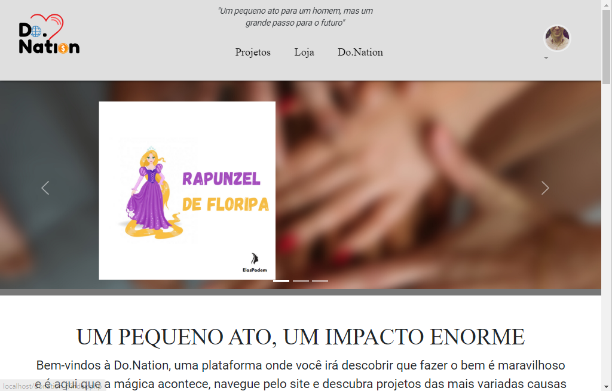

### Página de projetos
* Aqui estão todos os projetos cadastrados pela ONGs na registradas na plataforma.

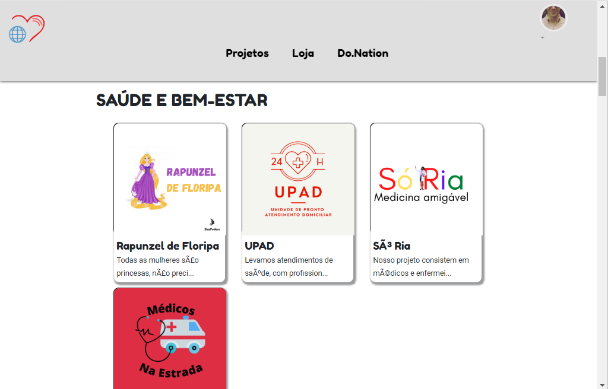

### Exibição do projeto selecionado

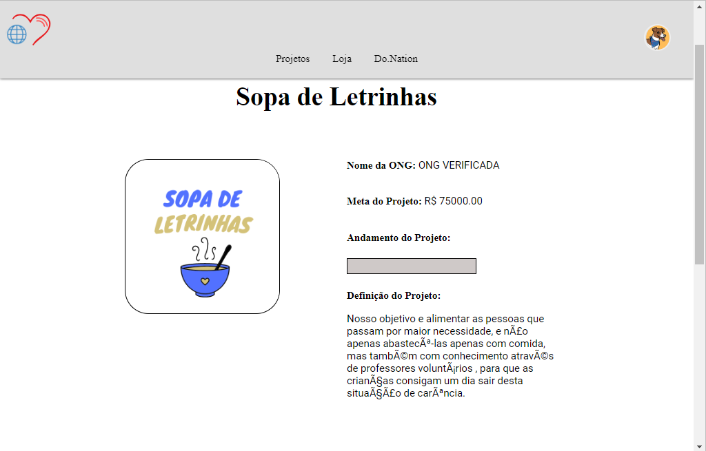

### Doar para o projeto

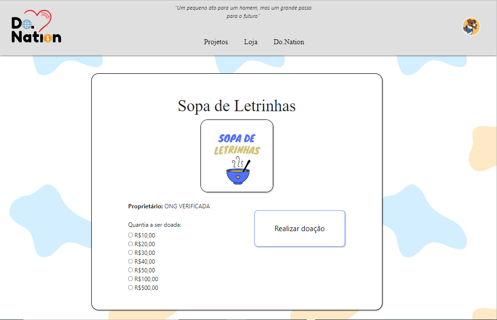

### Doar para o projeto (chave PIX)

* Chave PIX para doar para o projeto selecionado

### Loja de cupons (incompleto)

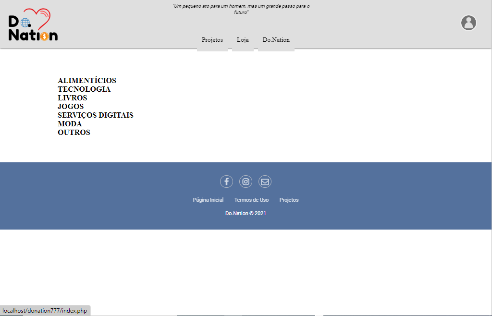

### Comprovante de doações do usuário

* O objetivo desse comprovante de doações é permitir à pessoa física ou jurídica deduzir o valor doado na sua declaração de imposto de renda

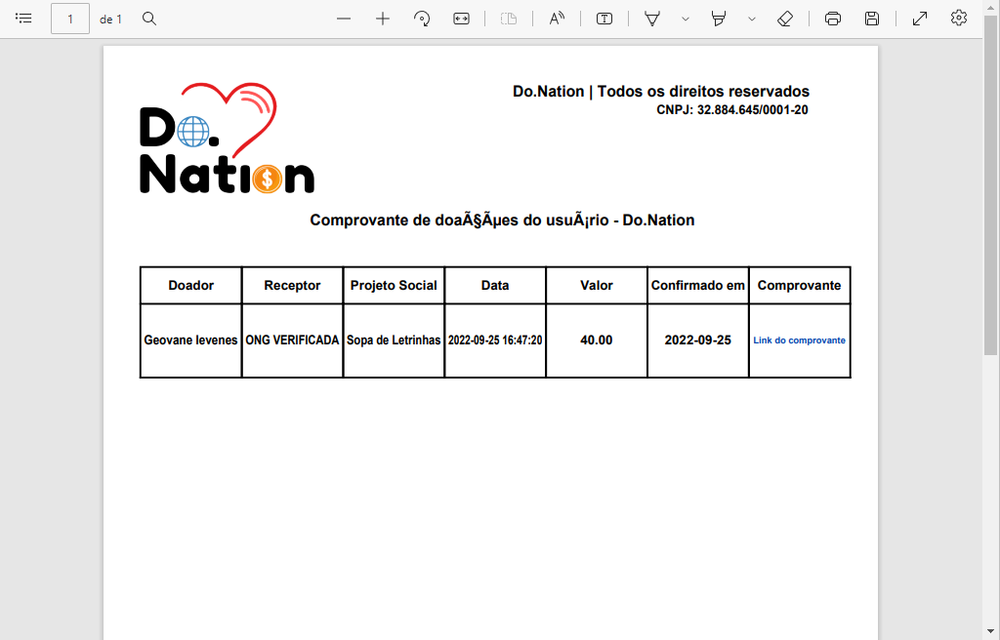

### Sobre nós 

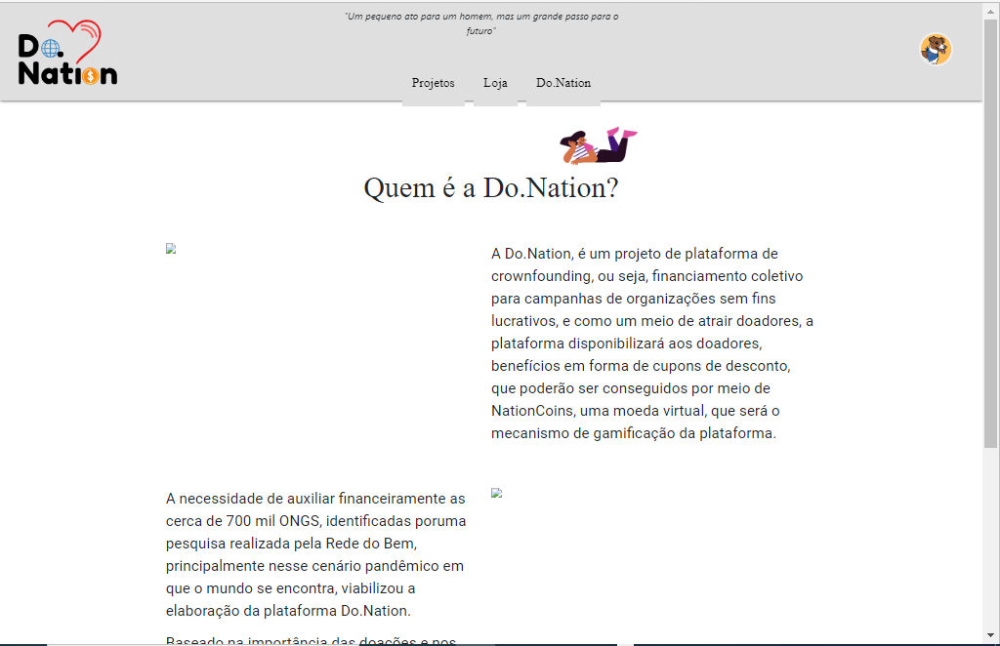

## Screenshots (Área do administrador do sistema)

### Menu administrativo

* Semelhante ao menu administrativo do Wordpress, seu objetivo é de permitir aos administradores do site gerenciarem as novas ONGs que estão se cadastrando no site.

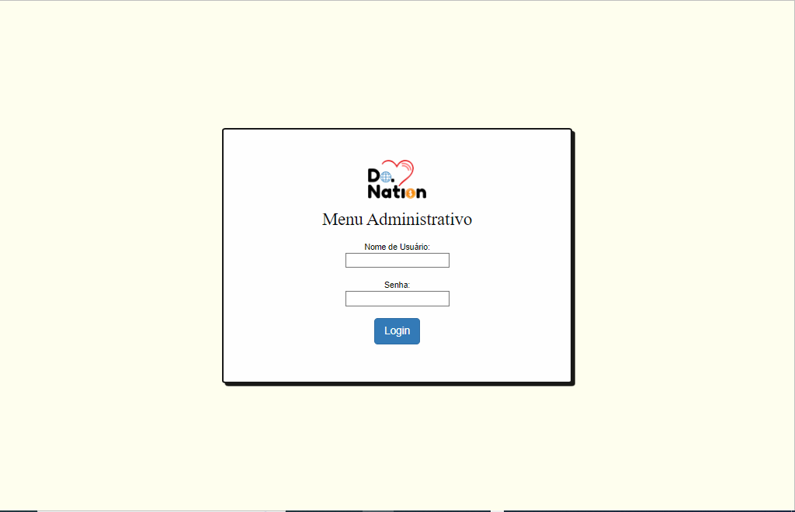

### Menu administrativo (index)

* Aqui, uma nova ONG acaba de se cadastrar no site. A solicitação contém as informações da ONG que acaba de concluir o registro, os documentos necessários para que ela faça o cadastro em nosso site - Isso serve como medida de segurança contra fraudes na plataforma - E a opção de aprovar ou reprovar o cadastro daquela ONG

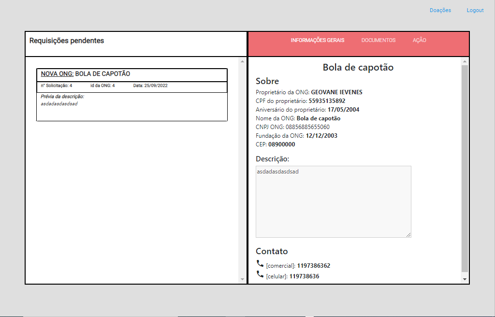

### Menu administrativo (doações realizadas)
* Como tínhamos 6 meses para desenvolver o projeto de TCC, mais as outras matérias do ensino médio, optamos por não usar um sistema de pagamento sandbox, e simulas um menu de aprovação de pagamentos, onde o administrador conferia o comprovante PIX de doação anexado pelo usuário, e então anexava um comprovante de transferência, indicando para o usuário que o valor doado por ele havia sido redirecionado para a Instituição Social, dando mais transparência e segurança no processo de doação. 

* Ao ser aprovada a transferência, o pagamento já deve aparecer para o usuário na lista de doações de seu perfil.

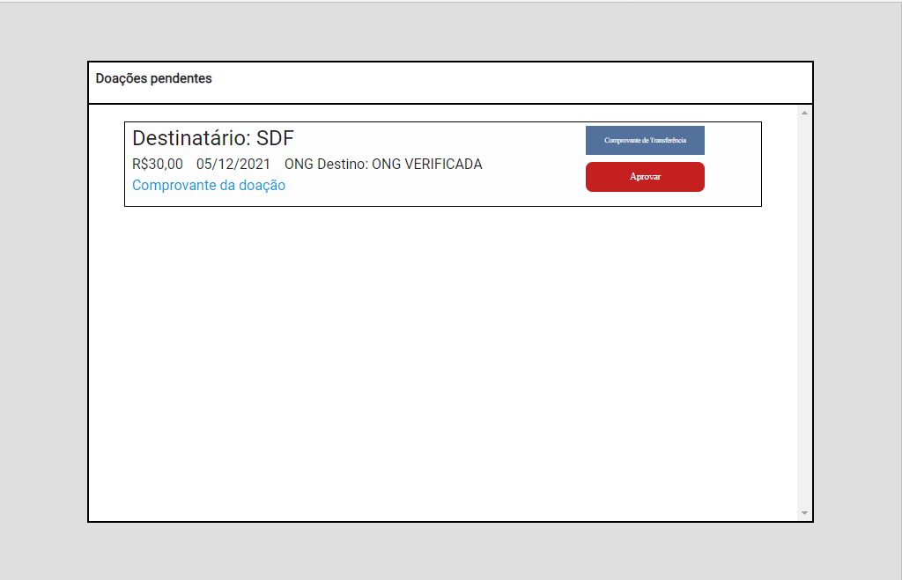
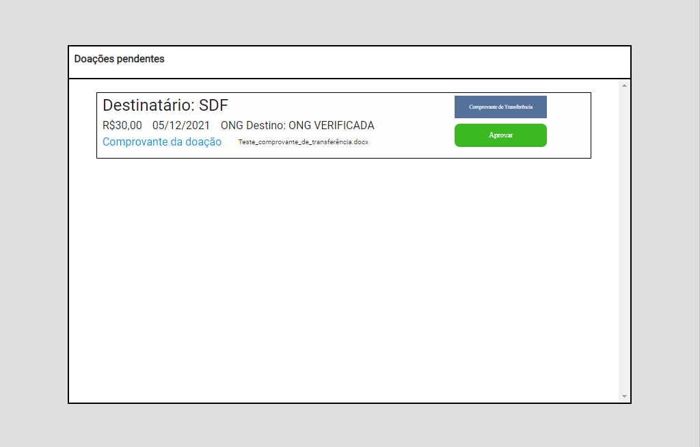

### Menu administrativo (Inserir novo cupom)

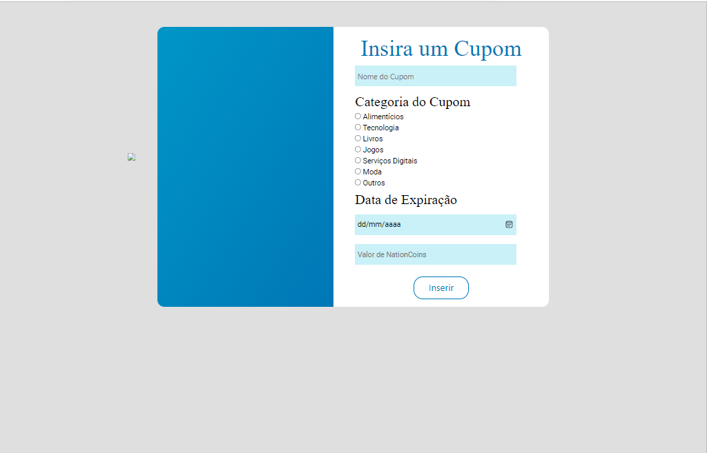

